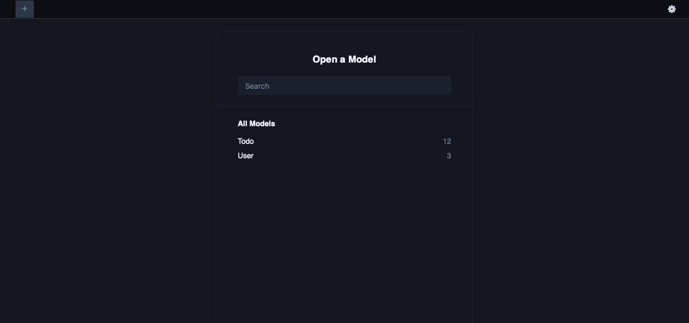
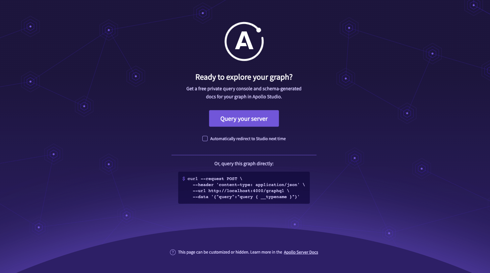

<a name="readme-top"></a>
[![Contributors][contributors-shield]][contributors-url]
[![Forks][forks-shield]][forks-url]
[![Stargazers][stars-shield]][stars-url]
[![Issues][issues-shield]][issues-url]
[![MIT License][license-shield]][license-url]
[![LinkedIn][linkedin-shield]][linkedin-url]


<!-- PROJECT LOGO -->
<br />
<div align="center">
  <a href="https://github.com/othneildrew/Best-README-Template">
    
  </a>

  <h3 align="center">Simple CRUD API by GraphQL</h3>

  <p align="center">
    Demonstrate my skills regarding Back End Development
    <br />
    <a href="#about-the-project"><strong>Explore the docs »</strong></a>
    <br />
    <br />
    <!-- <a href="https://github.com/othneildrew/Best-README-Template">View Demo</a>
    ·
    <a href="https://github.com/othneildrew/Best-README-Template/issues">Report Bug</a>
    ·
    <a href="https://github.com/othneildrew/Best-README-Template/issues">Request Feature</a> -->
  </p>
</div>

<!-- TABLE OF CONTENTS -->
<!-- <details> -->
  <summary>Table of Contents</summary>
  <ol>
    <li>
      <a href="#about-the-project">About The Project</a>
      <ul>
        <li><a href="#built-with">Built With</a></li>
      </ul>
    </li>
    <li>
      <a href="#getting-started">Getting Started</a>
      <ul>
        <li><a href="#prerequisites">Prerequisites</a></li>
        <li><a href="#installation">Installation</a></li>
      </ul>
    </li>
    <li><a href="#usage">Usage</a></li>
    <li><a href="#roadmap">Roadmap</a></li>
    <li><a href="#contributing">Contributing</a></li>
    <li><a href="#license">License</a></li>
    <li><a href="#contact">Contact</a></li>
    <li><a href="#acknowledgments">Acknowledgments</a></li>
  </ol>
<!-- </details> -->


<!-- ABOUT THE PROJECT -->
## About The Project


This is a simple GraphQL server that has basic CRUD features with Auth. This API demonstrates how Query and Mutation work. Moreover, Auth works with some operations.
The API is connected to DB running in the local environment. Therefore, you will be able to understand how GraphQL server is working in the real-world. This GraphQL server can be connected to any Postgres DB by changing the DB URL in the .env file.

<!-- Here's why:
* Your time should be focused on creating something amazing. A project that solves a problem and helps others
* You shouldn't be doing the same tasks over and over like creating a README from scratch
* You should implement DRY principles to the rest of your life :smile:

Of course, no one template will serve all projects since your needs may be different. So I'll be adding more in the near future. You may also suggest changes by forking this repo and creating a pull request or opening an issue. Thanks to all the people have contributed to expanding this template!

Here's a blank template to get started: To avoid retyping too much info. Do a search and replace with your text editor for the following: `github_username`, `repo_name`, `twitter_handle`, `linkedin_username`, `email_client`, `email`, `project_title`, `project_description` -->

<p align="right">(<a href="#readme-top">back to top</a>)</p>


### Built With

* Node.js
* Express.js
* GraphQL
* Apollo GraphQL
* TypeScript
* Postgres
* Prisma
* Docker
* Json Web Token

and so on...

You can see the list of packages in [package.json]("./package.json") file.


<!-- * [![Next][Next.js]][Next-url]
* [![React][React.js]][React-url]
* [![Vue][Vue.js]][Vue-url]
* [![Angular][Angular.io]][Angular-url]
* [![Svelte][Svelte.dev]][Svelte-url]
* [![Laravel][Laravel.com]][Laravel-url]
* [![Bootstrap][Bootstrap.com]][Bootstrap-url]
* [![JQuery][JQuery.com]][JQuery-url] -->

<p align="right">(<a href="#readme-top">back to top</a>)</p>


<!-- GETTING STARTED -->
## Getting Started

There are instructions on setting up this project locally.
To get a local copy up and running follow these simple steps.

### Prerequisites

* node >= v16.17.0
  * [npm](https://nodejs.org/en/download/)
  <!-- ```sh
  npm install npm@16.17.0 -g
  ``` -->
* [docker](https://docs.docker.com/get-docker/)

### Installation
 
1. Clone the repo and enter the directory
   ```sh
   git clone https://github.com/TOMO-YOSHI/simple-crud-api.git
   cd simple-crud-api
   ```
2. Install NPM packages
   ```sh
   npm install
   ```
3. Run DB server by docker-compose
   ```sh
   docker-compose up
   ```
4. Set up DB schema
   ```sh
   npx prisma migrate dev --name init
   ```
5. Insert test data into DB
   ```sh
   npx ts-node ./src/prisma/seed.ts
   ```
6. Run prisma studio to see DB on browser
   ```sh
   npx prisma studio
   ```
   Open `http://localhost:5556` on your browser and confirm the DB is running and the test data was successfully inserted.

   

   There should be two entities, `Todo` and `User`.
   And the test data has already been inserted.

   
7. Run GraphQL-Express server in production-mode
   ```sh
   npm run start
   ```
    - If you encounter any build errors, I recommend you to run GraphQL-Express server in **dev-mode**
      ```sh
      npm run dev
      ```
   Open `http://localhost:4000/graphql` and Click `Query your server` button.
    
8. Done 🚀🚀🚀

    You can start calling GraphQL query and mutation on the console
    

<p align="right">(<a href="#readme-top">back to top</a>)</p>


<!-- USAGE EXAMPLES -->
## Usage

Use this space to show useful examples of how a project can be used. Additional screenshots, code examples and demos work well in this space. You may also link to more resources.

_For more examples, please refer to the [Documentation](https://example.com)_

<p align="right">(<a href="#readme-top">back to top</a>)</p>


<!-- ROADMAP -->
## Roadmap

- [ ] Feature 1
- [ ] Feature 2
- [ ] Feature 3
    - [ ] Nested Feature

See the [open issues](https://github.com/github_username/repo_name/issues) for a full list of proposed features (and known issues).

<p align="right">(<a href="#readme-top">back to top</a>)</p>


<!-- CONTRIBUTING -->
## Contributing

Contributions are what make the open source community such an amazing place to learn, inspire, and create. Any contributions you make are **greatly appreciated**.

If you have a suggestion that would make this better, please fork the repo and create a pull request. You can also simply open an issue with the tag "enhancement".
Don't forget to give the project a star! Thanks again!

1. Fork the Project
2. Create your Feature Branch (`git checkout -b feature/AmazingFeature`)
3. Commit your Changes (`git commit -m 'Add some AmazingFeature'`)
4. Push to the Branch (`git push origin feature/AmazingFeature`)
5. Open a Pull Request

<p align="right">(<a href="#readme-top">back to top</a>)</p>


<!-- LICENSE -->
## License

Distributed under the MIT License. See `LICENSE.txt` for more information.

<p align="right">(<a href="#readme-top">back to top</a>)</p>


<!-- CONTACT -->
## Contact

Your Name - [@twitter_handle](https://twitter.com/twitter_handle) - email@email_client.com

Project Link: [https://github.com/github_username/repo_name](https://github.com/github_username/repo_name)

<p align="right">(<a href="#readme-top">back to top</a>)</p>


<!-- ACKNOWLEDGMENTS -->
## Acknowledgments

* []()
* []()
* []()

<p align="right">(<a href="#readme-top">back to top</a>)</p>


<!-- MARKDOWN LINKS & IMAGES -->
<!-- https://www.markdownguide.org/basic-syntax/#reference-style-links -->
[contributors-shield]: https://img.shields.io/github/contributors/TOMO-YOSHI/simple-crud-api.svg?style=for-the-badge
[contributors-url]: https://github.com/TOMO-YOSHI/simple-crud-api/graphs/contributors
[forks-shield]: https://img.shields.io/github/forks/TOMO-YOSHI/simple-crud-api.svg?style=for-the-badge
[forks-url]: https://github.com/TOMO-YOSHI/simple-crud-api/network/members
[stars-shield]: https://img.shields.io/github/stars/TOMO-YOSHI/simple-crud-api.svg?style=for-the-badge
[stars-url]: https://github.com/TOMO-YOSHI/simple-crud-api/stargazers
[issues-shield]: https://img.shields.io/github/issues/TOMO-YOSHI/simple-crud-api.svg?style=for-the-badge
[issues-url]: https://github.com/TOMO-YOSHI/simple-crud-api/issues
[license-shield]: https://img.shields.io/github/license/TOMO-YOSHI/simple-crud-api.svg?style=for-the-badge
[license-url]: https://github.com/TOMO-YOSHI/simple-crud-api/blob/master/LICENSE.txt
[linkedin-shield]: https://img.shields.io/badge/-LinkedIn-black.svg?style=for-the-badge&logo=linkedin&colorB=555
[linkedin-url]: https://www.linkedin.com/in/tomohiro/
[product-screenshot]: assets/images/graphql_ss.png
[Next.js]: https://img.shields.io/badge/next.js-000000?style=for-the-badge&logo=nextdotjs&logoColor=white
[Next-url]: https://nextjs.org/
[React.js]: https://img.shields.io/badge/React-20232A?style=for-the-badge&logo=react&logoColor=61DAFB
[React-url]: https://reactjs.org/
[Vue.js]: https://img.shields.io/badge/Vue.js-35495E?style=for-the-badge&logo=vuedotjs&logoColor=4FC08D
[Vue-url]: https://vuejs.org/
[Angular.io]: https://img.shields.io/badge/Angular-DD0031?style=for-the-badge&logo=angular&logoColor=white
[Angular-url]: https://angular.io/
[Svelte.dev]: https://img.shields.io/badge/Svelte-4A4A55?style=for-the-badge&logo=svelte&logoColor=FF3E00
[Svelte-url]: https://svelte.dev/
[Laravel.com]: https://img.shields.io/badge/Laravel-FF2D20?style=for-the-badge&logo=laravel&logoColor=white
[Laravel-url]: https://laravel.com
[Bootstrap.com]: https://img.shields.io/badge/Bootstrap-563D7C?style=for-the-badge&logo=bootstrap&logoColor=white
[Bootstrap-url]: https://getbootstrap.com
[JQuery.com]: https://img.shields.io/badge/jQuery-0769AD?style=for-the-badge&logo=jquery&logoColor=white
[JQuery-url]: https://jquery.com